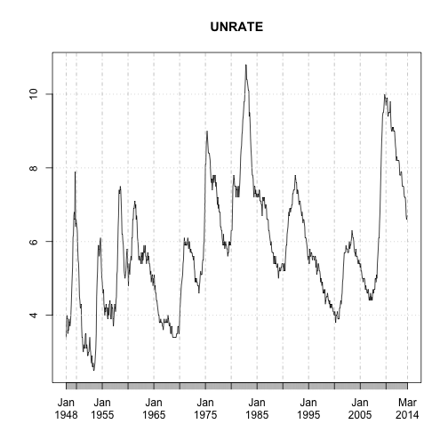

Open Source Capital Modeling Project
========================================================

This is an exploration of current open source tools available for building capital models for financial services companies.  This project started as a way to learn about best practices from the reproducable research movement in academia.  I wanted to learn how to leverage those techniques to build documentation and presentations using output from a capital model that could refresh automatically when a new model run was complete.  

That idea led to an option of either creating dummy data to test these techniques.  While starting down that rabit hole, I decided to set back and try to frankenstine together a very basic open source capital model that can be used publically for trainings and presentations.  

The project is not intended to be even close to state of the art or scaleable for commercial use.

ESG
--------
Lets start by testing various ways to load in history to calibrate models.


```r
library(quantmod)
getSymbols("UNRATE", src = "FRED")  # US Unemployment rate rates from FRED
```

```
## [1] "UNRATE"
```

```r
plot(UNRATE)
```

 

```r

library(forecast)
```

```
## Error: package or namespace load failed for 'forecast'
```

```r
plot(forecast(UNEMP))
```

```
## Error: error in evaluating the argument 'x' in selecting a method for function 'plot': Error: could not find function "forecast"
```

```r
library(FRBData)

GetInterestRates("TCMNOM", lastObs = 5)  # get some data, treauries constant maturities/Nominal
```

```
##              1M   3M   6M   1Y   2Y   3Y   5Y   7Y  10Y  20Y  30Y
## 2014-04-11 0.04 0.04 0.06 0.09 0.37 0.80 1.58 2.16 2.63 3.22 3.48
## 2014-04-14 0.03 0.04 0.06 0.10 0.37 0.82 1.61 2.18 2.65 3.23 3.48
## 2014-04-15 0.03 0.04 0.05 0.11 0.39 0.84 1.63 2.18 2.64 3.20 3.46
## 2014-04-16 0.03 0.04 0.05 0.11 0.39 0.87 1.67 2.21 2.65 3.20 3.45
## 2014-04-17 0.02 0.03 0.05 0.11 0.43 0.91 1.75 2.31 2.73 3.27 3.52
```

```r

library(Quandl)
Treasuries = Quandl("USTREASURY/YIELD", collapse = "monthly", start_date = "1970-01-01", 
    type = "ts")
```

```
## Warning: It would appear you aren't using an authentication token. Please
## visit http://www.quandl.com/help/r or your usage may be limited.
```

```r
plot(Treasuries[, 7])
```

 

```r
summary(Treasuries)
```

```
##       1 Mo           3 Mo           6 Mo           1 Yr     
##  Min.   :0.01   Min.   :0.01   Min.   :0.04   Min.   :0.10  
##  1st Qu.:0.07   1st Qu.:0.95   1st Qu.:1.02   1st Qu.:1.24  
##  Median :0.96   Median :3.50   Median :3.61   Median :3.75  
##  Mean   :1.48   Mean   :3.19   Mean   :3.33   Mean   :3.46  
##  3rd Qu.:2.13   3rd Qu.:5.12   3rd Qu.:5.27   3rd Qu.:5.41  
##  Max.   :5.24   Max.   :8.07   Max.   :8.44   Max.   :8.58  
##  NA's   :138                                                
##       2 Yr           3 Yr           5 Yr           7 Yr     
##  Min.   :0.20   Min.   :0.30   Min.   :0.59   Min.   :0.98  
##  1st Qu.:1.59   1st Qu.:1.95   1st Qu.:2.78   1st Qu.:3.32  
##  Median :4.21   Median :4.43   Median :4.59   Median :4.79  
##  Mean   :3.79   Mean   :4.01   Mean   :4.43   Mean   :4.75  
##  3rd Qu.:5.67   3rd Qu.:5.81   3rd Qu.:6.02   3rd Qu.:6.22  
##  Max.   :8.96   Max.   :9.05   Max.   :9.04   Max.   :9.06  
##                                                             
##      10 Yr          20 Yr          30 Yr     
##  Min.   :1.51   Min.   :2.21   Min.   :2.56  
##  1st Qu.:3.83   1st Qu.:4.32   1st Qu.:4.40  
##  Median :4.87   Median :5.05   Median :5.68  
##  Mean   :5.01   Mean   :5.14   Mean   :5.65  
##  3rd Qu.:6.28   3rd Qu.:6.12   3rd Qu.:6.90  
##  Max.   :9.04   Max.   :8.10   Max.   :9.00  
##                 NA's   :45     NA's   :47
```


You can also embed plots, for example:


```r
plot(cars)
```

 


